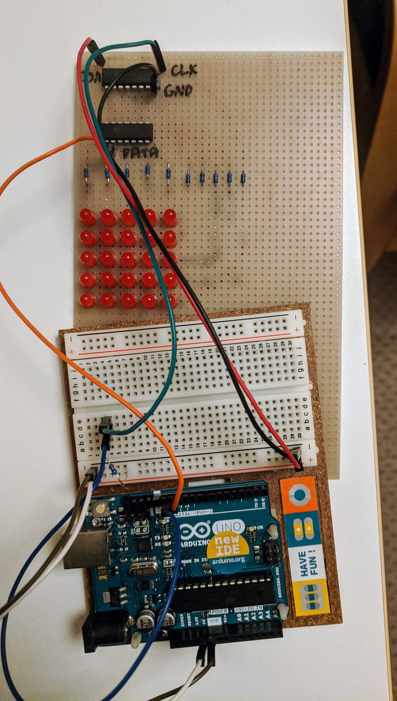
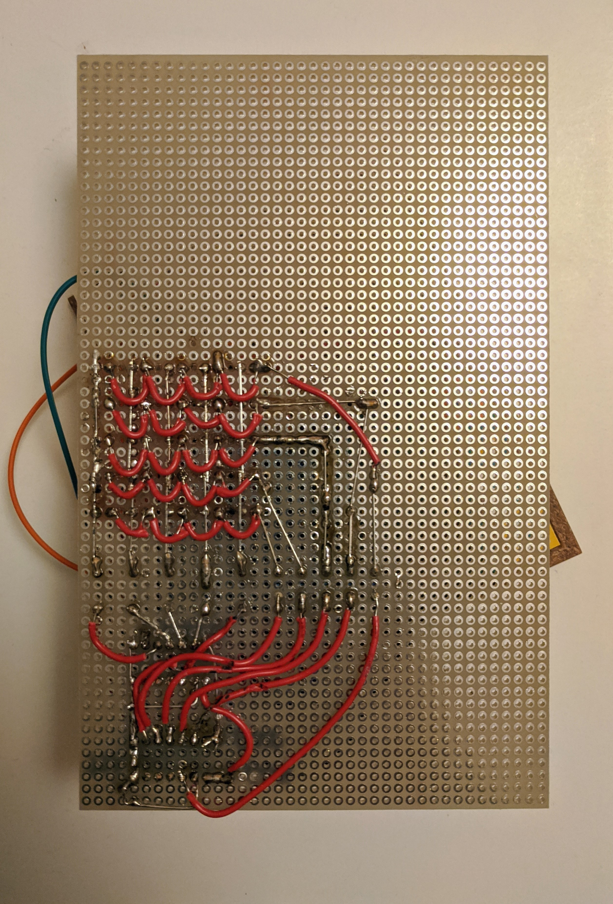

# Arduino LED display

A small electronics project involving an Arduino, a joystick, and a few LEDs. Actually, I only put together the LED display part. This was already a lot of work for me as a newbie.

In the end, the solution does not work as good as I thought. Using 2 shift registers in a row means that I only need to use 2 outputs from the Arduino but the display is too slow.

This was a fun learning experience for me as a beginner in hobby electronics.

## Photos

